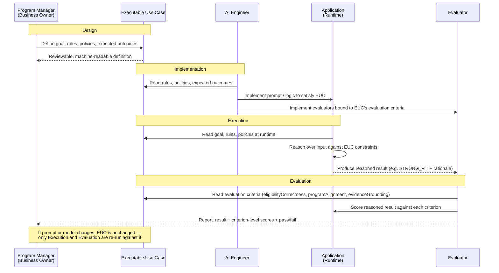

# Executable Use Cases: Preserving Business Intent Across the AI Application Lifecycle

*InfoQ AI Engineering Certification — System-Building Project*

<details>
<summary><strong>Machine-readable summary</strong> (structured recap of this document — click to expand)</summary>

```json
{
  "id": "euc-capstone-proposal",
  "centralClaim": {
    "id": "claim-1-primary",
    "statement": "When the underlying prompt or model changes, evaluation against a fixed EUC will detect meaningful drift from business intent, without the EUC itself needing to change.",
    "failureModes": [
      {"id": "false-negative", "risk": "high", "description": "Behavior drifts but evaluation still passes"},
      {"id": "false-positive", "risk": "medium", "description": "Evaluation flags drift when behavior has not diverged"}
    ]
  },
  "secondaryClaim": {
    "id": "claim-2-secondary",
    "statement": "Deterministic and LLM-reasoned portions of the EUC behave differently under prompt/model changes; deterministic results should remain stable."
  },
  "artifact": {
    "name": "Executable Use Case (EUC)",
    "fields": ["id", "actor", "goal", "executionPipeline", "policies", "expectedOutcomes", "evaluationPipeline"],
    "designPattern": "Pipe-and-Filter",
    "ruleTypes": ["deterministic", "reasoned"],
    "constraints": {
      "executionPipeline": "non-empty; one or more filter stages",
      "evaluationPipeline": "non-empty; one or more filter stages",
      "enforcedBy": "EucDefinition.validate(), called by EucLoader at load time"
    },
    "roadmap": {
      "field": "group",
      "currentBehavior": "every stage has a unique group number; execution is fully serialized in array order",
      "futureBehavior": "stages sharing a group number may execute concurrently once a parallel-aware PipelineBuilder exists"
    }
  },
  "relatedWork": {
    "comparedTo": "Spec-Driven Development (SDD)",
    "keyDistinction": "SDD anchors code generation from a spec authored mainly at build time; EUCs anchor runtime reasoning behavior and evaluation continuously, targeting drift in a probabilistic component rather than code/spec divergence."
  },
  "caseStudy": {
    "name": "Grant Fit Assessment",
    "expectedOutcomes": ["STRONG_FIT", "POSSIBLE_FIT", "POOR_FIT"],
    "evaluationCriteria": ["eligibilityCorrectness", "programAlignment", "evidenceGrounding"]
  },
  "metrics": [
    {"id": "drift-detection-rate", "name": "Drift detection rate"},
    {"id": "false-flag-rate", "name": "False-flag rate"},
    {"id": "deterministic-rule-stability", "name": "Deterministic-rule stability"},
    {"id": "evidence-grounding-consistency", "name": "Evidence-grounding consistency"}
  ],
  "sections": [
    {"num": 1, "id": "problem-statement", "title": "Problem Statement"},
    {"num": 2, "id": "gap-in-current-practice", "title": "Gap in Current Practice"},
    {"num": 3, "id": "related-work-spec-driven-development-vs-executable-use-cases", "title": "Related Work: Spec-Driven Development vs. Executable Use Cases"},
    {"num": 4, "id": "proposed-approach", "title": "Proposed Approach: Executable Use Cases"},
    {"num": 5, "id": "falsifiable-claims", "title": "Falsifiable Claims"},
    {"num": 6, "id": "case-study-grant-fit-assessment", "title": "Case Study: Grant Fit Assessment"},
    {"num": 7, "id": "evaluation-methodology", "title": "Evaluation Methodology"},
    {"num": 8, "id": "expected-outcomes-contribution", "title": "Expected Outcomes / Contribution"},
    {"num": 9, "id": "limitations-future-work", "title": "Limitations & Future Work"}
  ]
}
```

</details>

| # | Section | Purpose |
|---|---|---|
| 1 | [Problem Statement](#1-problem-statement) | Why AI-native evaluation drifts from business intent |
| 2 | [Gap in Current Practice](#2-gap-in-current-practice) | Why existing artifacts don't solve this |
| 3 | [Related Work: SDD vs. EUC](#3-related-work-spec-driven-development-vs-executable-use-cases) | How this differs from Spec-Driven Development |
| 4 | [Proposed Approach: Executable Use Cases](#4-proposed-approach-executable-use-cases) | The EUC schema and lifecycle |
| 5 | [Falsifiable Claims](#5-falsifiable-claims) | What would prove or disprove the approach |
| 6 | [Case Study: Grant Fit Assessment](#6-case-study-grant-fit-assessment) | The test application and why it fits |
| 7 | [Evaluation Methodology](#7-evaluation-methodology) | Experimental design and metrics |
| 8 | [Expected Outcomes / Contribution](#8-expected-outcomes--contribution) | What this delivers if it works |
| 9 | [Limitations & Future Work](#9-limitations--future-work) | Scope boundaries and open questions |

---

## 1. Problem Statement

As organizations move AI-native applications from prototype to production, they're running into a problem traditional software evaluation wasn't built for: the criteria for "correct" behavior are inherently fuzzier, and they drift. A prompt tweak, a model upgrade, or a context-window change can silently shift what an application does — while the tests, dashboards, and stakeholders still assume the original intent holds. Unlike deterministic systems, where a passing test suite is a reliable proxy for correctness, LLM-based applications can drift in ways that pass superficial checks while failing the underlying business goal.

This is compounded by a second problem: business intent itself becomes fragmented — partly in a requirements doc, partly in a prompt, partly in application logic, partly in ad hoc eval scripts — with no single artifact anyone can point to as the source of truth. When a model changes, teams often can't say with confidence whether they're still building the same thing they set out to build.

This project proposes **Executable Use Cases (EUCs)**: first-class, machine-readable SDLC artifacts that encode a use case's goals, rules, constraints, expected outcomes, and evaluation criteria in a single definition that drives both execution and evaluation.

**Business Intent → EUC → Execution + Evaluation**

The approach will be validated through a [Grant Fit Assessment](#6-case-study-grant-fit-assessment) case study: an AI-native application where the same EUC governs both runtime behavior and evaluation. As the underlying prompt or model changes, the case study tests whether the application can still be evaluated against a stable, unchanged definition of business intent.

---

## 2. Gap in Current Practice

AI-native applications spread business logic across prompts, retrieved context, model behavior, application code, and policy constraints — each of which can change independently, and each of which only partially reflects the original business intent. A conventional application encodes its logic once, in code that can be inspected and diffed; an AI-native application has no equivalent single place to look.

```
                 Business Intent
                       |
        +--------------+--------------+
        |              |              |
        v              v              v
   Application       Prompt /       Evaluation
      Logic           Context        Criteria
```

This creates a concrete failure mode: a team updates a prompt or swaps in a new model, and the evaluation suite still passes — not because business intent was preserved, but because the evaluation criteria were never actually anchored to that intent. They were derived from it once, informally, then maintained separately, so the eval and the application drift apart silently until a stakeholder notices the output is wrong.

Existing practice treats this as a documentation problem — requirements docs, prompt changelogs, hand-maintained eval cases — but each artifact serves a different audience on a different cadence, so keeping them consistent depends on discipline, not structure. None functions as a single, machine-readable definition both the application and its evaluation can be checked against, which is why a passing eval is only weak evidence: it shows internal consistency, not that intent was preserved.

---

## 3. Related Work: Spec-Driven Development vs. Executable Use Cases

The gap in Section 2 raises an obvious question: doesn't Spec-Driven Development (SDD) already solve this? SDD — the methodology behind tools like GitHub's Spec Kit — treats a formal, machine-readable specification as the authoritative source of truth from which implementation, tests, and documentation are derived. Teams define requirements, constraints, and acceptance criteria up front, then use AI to generate code and supporting artifacts from that shared context. It's a real answer to a real problem: ad hoc, code-first AI development that skips requirements analysis.

But SDD and EUCs target different failure modes, and the distinction matters for what each approach can and can't detect:

| | Spec-Driven Development | Executable Use Cases |
|---|---|---|
| Primary output the spec drives | Generated code, tests, docs | Runtime reasoning behavior *and* evaluation criteria |
| When the spec matters most | Build time — before/during implementation | Continuously — consulted at every inference, not just at build time |
| What "drift" means | The code diverging from the spec (a version-control problem) | The model's judgment diverging from business intent even though the code hasn't changed (a non-determinism problem) |
| What changes over the artifact's life | The spec is updated when requirements change; code is regenerated | The EUC stays fixed on purpose while the model/prompt underneath it changes — testing whether evaluation still holds |
| Core discipline | Software engineering — turning requirements into working code | AI evaluation — detecting when a probabilistic component silently stops doing what was intended |

The sharpest distinction: SDD is fundamentally about **generation** — spec in, code out, largely a one-time (or requirements-triggered) translation. EUCs are fundamentally about **evaluation under drift** — the spec doesn't change; the thing running underneath it does (a new model version, a tweaked prompt); the question is whether the same fixed definition can still tell you if behavior stayed correct. SDD has no real story for "the code didn't change but the model's judgment did," because that failure mode is specific to LLM-reasoned components rather than generated code — exactly the gap Section 2 identifies.

This is not a claim that the two are unrelated. Some SDD framings — IBM's "spec-anchored" tier, and proposals like Constitutional Spec-Driven Development — already treat the spec as a living artifact that governs behavior post-generation, not just at build time, which is closer to what EUCs do. And the relationship runs the other way too: because the EUC schema is pattern-driven and opinionated (Section 4), it has an obvious secondary use as a code-generation scaffold — the same `executionPipeline`/`evaluationPipeline` structure that anchors evaluation could drive a `PipelineBuilder` that assembles application code mechanically. That secondary use isn't a claim this project tests (Section 5), but it means EUCs and SDD are better understood as overlapping with different centers of gravity than as competing alternatives.

---

## 4. Proposed Approach: Executable Use Cases

An Executable Use Case (EUC) represents the business intent and expected behavior of a use case in a form consumable by both people and software — a single definition an application is built against and evaluated against, rather than two definitions maintained in parallel.

The schema is deliberately shaped around the **Pipe-and-Filter** pattern: each execution stage names a `filter` — a lookup key into a filter registry — so a pipeline can be assembled mechanically from the EUC rather than hand-wired per use case. A pipeline is comprised of one or more filters; the exact number and mix depends on what each EUC's contract requires, without any orchestration code changing. A use case with a single deterministic check is a valid one-filter pipeline; Grant Fit Assessment's four-stage pipeline is just a larger instance of the same contract, not a structurally different case.

```json
{
  "id": "grant-fit-assessment",
  "actor": "Nonprofit Program Manager",
  "goal": "Determine whether the organization should pursue a grant",
  "executionPipeline": [
    {
      "id": "ELIGIBILITY-001",
      "filter": "eligibility",
      "type": "deterministic",
      "description": "Applicant must satisfy mandatory eligibility requirements",
      "onFailure": "halt",
      "group": 1
    },
    {
      "id": "ALIGNMENT-001",
      "filter": "alignmentReasoning",
      "type": "reasoned",
      "description": "Organization's mission and programs must be assessed for alignment with the funder's stated priorities",
      "onFailure": "continue",
      "group": 4
    }
  ],
  "policies": [
    "Do not invent missing information",
    "Support conclusions with evidence"
  ],
  "expectedOutcomes": [
    "STRONG_FIT",
    "POSSIBLE_FIT",
    "POOR_FIT"
  ],
  "evaluationPipeline": [
    {
      "id": "eligibilityCorrectness",
      "filter": "eligibilityCorrectness",
      "evaluates": ["ELIGIBILITY-001"]
    },
    {
      "id": "programAlignment",
      "filter": "programAlignment",
      "evaluates": ["ALIGNMENT-001"]
    }
  ]
}
```

*(Abbreviated for readability — the full EUC has four execution stages and three evaluation stages; see `src/main/resources/euc/grant-fit-assessment.json` in the repo.)*

| Field | Purpose |
|---|---|
| `executionPipeline` | An **ordered, non-empty** list of filter stages (one or more) — an EUC with no stages defines no behavior, so an empty pipeline is invalid. Order matters — deterministic stages run before reasoned ones, so a cheap check can short-circuit an expensive model call |
| `executionPipeline[].filter` | A lookup key into a filter registry; a `PipelineBuilder` assembles the runtime chain from this list mechanically, without per-use-case orchestration code |
| `executionPipeline[].type` | `deterministic` (hard pass/fail check) or `reasoned` (requires an LLM to weigh evidence and judgment) |
| `executionPipeline[].onFailure` | `halt` or `continue` — makes short-circuit behavior an explicit schema contract. In Grant Fit Assessment, a failed eligibility stage halts the pipeline: strong alignment cannot rescue a failed mandatory requirement (Section 6) |
| `executionPipeline[].group` | An integer ordering stages into execution groups. Stages execute in ascending `group` order; stages *sharing* a group number are candidates for concurrent execution by a future engine |
| `policies` | Behavioral constraints that don't map to a single stage (e.g., "do not invent missing information") but must still be enforced at runtime and checked during evaluation |
| `expectedOutcomes` | The closed set of valid classifications the use case can resolve to |
| `evaluationPipeline` | A **structurally parallel, non-empty** list of evaluation stages (one or more) — same shape as `executionPipeline`, so the same pattern drives both |
| `evaluationPipeline[].evaluates` | The execution stage `id`s this evaluation stage checks — makes the link between what ran and what got scored traceable rather than implicit |

**On serialization:** this version executes strictly in array order — every stage in the Grant Fit Assessment EUC is given its own unique `group` number (1 through 4), so behavior is fully serialized, matching the current `onFailure: halt` short-circuit logic that depends on eligibility running before alignment reasoning. Nothing today reads `group` to parallelize execution. It's included now because retrofitting an ordering concept into the schema after a `PipelineBuilder` exists and downstream code assumes strict array order would be a breaking change; adding it up front costs nothing and keeps the door open. A future engine could execute same-group stages concurrently — for Grant Fit Assessment, `GEOGRAPHY-001` and `INFO-001` are plausible candidates, since neither depends on the other's result — without any change to this schema.

The contribution is not the JSON format — a schema is an implementation detail. The contribution is that the use case exists once, as a first-class SDLC artifact, rather than being translated separately into application logic and evaluation criteria by different people at different times — the divergence [Section 2](#2-gap-in-current-practice) describes. Structuring that artifact as an ordered, filter-keyed pipeline is what makes the translation mechanical: given the schema above, both the execution chain and the evaluation chain can be *generated* from the EUC rather than hand-authored per use case, so the EUC's benefit extends beyond evaluation into scaffolding the application's own code shape — the overlap with SDD noted in Section 3.

### EUC Across the Lifecycle



| Phase | Who | Reads from the EUC |
|---|---|---|
| Design | Business owner | Authors goal, rules, policies, expected outcomes directly — reviewable without engineering context |
| Implementation | AI engineer | Builds both application logic and evaluators from the same artifact, not a secondhand derivation |
| Execution | Application | Consults rules and policies at runtime; produces an outcome plus rationale |
| Evaluation | Evaluator | Scores the result against the same criteria the engineer implemented against |

That last row is what the case study is designed to test: when a prompt or model changes, only Execution and Evaluation re-run — the EUC, and therefore the definition of correctness, stays fixed.

---

## 5. Falsifiable Claims

**Primary claim** (`claim-1-primary`): when the underlying prompt or model changes, evaluation against a fixed EUC will detect meaningful drift from business intent, without the EUC itself needing to change. This claim fails in two directions:

- **False negative** *(the risk that matters most)* — behavior changes (e.g., reasoning shifts from evidence-grounded to speculative, or alignment judgments become inconsistent) but evaluation still reports a pass. This would mean EUC-driven evaluation offers no real advantage over the status quo it's meant to replace.
- **False positive** — evaluation flags drift when behavior hasn't actually diverged. This would mean the evaluation criteria are too brittle or too tightly coupled to a specific implementation to serve as a stable definition of correctness.

**Secondary claim** (`claim-2-secondary`): the deterministic and LLM-reasoned portions of the EUC should behave differently under these changes. [Section 6](#6-case-study-grant-fit-assessment) establishes that only the LLM-reasoning layer (alignment, evidence interpretation, explanation) is exposed to prompt or model drift, while deterministic rules (eligibility, geography) should stay stable regardless of model changes. If deterministic results shift too, that indicates a flaw in the EUC's separation of concerns, not a success of the approach.

Both claims are deliberately falsifiable: a negative result — failing to catch known, deliberately introduced drift — is a legitimate, informative outcome, not just a validation exercise.

---

## 6. Case Study: Grant Fit Assessment

Nonprofits fund programs in part by applying for grants, each with its own eligibility requirements, funding priorities, and program objectives. Applying takes real staff time, so nonprofits need to know in advance whether an opportunity is worth pursuing.

A Grant Fit Assessment answers that question: it compares an organization's profile and programs against a grant's requirements and priorities to determine eligibility and alignment. Neither substitutes for the other — an organization can be eligible and still a poor fit, and strong alignment cannot overcome a failed mandatory requirement.

This combination makes Grant Fit Assessment a useful testbed, since it splits into two kinds of logic that behave differently under evaluation:

| Deterministic Logic | LLM Reasoning |
|---|---|
| Organization eligibility | Mission alignment |
| Geographic requirements | Program alignment |
| Required information present | Evidence interpretation |
| Mandatory constraints | Explanation generation |

Eligibility is deterministic — it either passes or fails, and a rule change is a code change. Fit assessment requires the LLM to weigh mission/program alignment against the funder's stated priorities using supporting evidence. This split isolates where EUC-driven evaluation earns its value: deterministic rules can be checked conventionally, but LLM reasoning is exactly the layer where prompt or model changes are most likely to silently drift from business intent — the failure mode [Section 2](#2-gap-in-current-practice) identifies.

| | Description |
|---|---|
| **Inputs** | Organization profile and programs, grant opportunity and funding priorities, eligibility requirements, relevant supporting information |
| **Outputs** | Eligibility status, `STRONG_FIT` / `POSSIBLE_FIT` / `POOR_FIT` classification, supporting evidence, explanation, identified uncertainty |

---

## 7. Evaluation Methodology

To test the claims in [Section 5](#5-falsifiable-claims), the case study holds the EUC fixed and introduces controlled changes to the execution layer, then measures whether evaluation against the unchanged EUC still tracks the resulting behavior.

**Experimental design:**

| Step | Action |
|---|---|
| 1. Baseline | Implement Grant Fit Assessment against a single EUC, with a fixed prompt and model. Run against a curated set of test cases spanning `STRONG_FIT`, `POSSIBLE_FIT`, and `POOR_FIT`, plus edge cases (eligible but poorly aligned; ineligible but well-aligned) |
| 2. Establish ground truth | Independently of the application, reviewed against the EUC's rules and policies |
| 3. Introduce controlled changes | To the execution layer only — swap the model, edit the prompt's alignment instructions, alter how evidence is presented — without modifying the EUC |
| 4. Re-run the same evaluators | Bound to `eligibilityCorrectness`, `programAlignment`, `evidenceGrounding` — against the new outputs, using the same ground truth |
| 5. Classify each change | As detected or undetected drift, compared against whether the change was known to alter behavior |

**Metrics:**

| Metric | What it measures |
|---|---|
| `drift-detection-rate` | % of deliberately behavior-altering changes correctly flagged by evaluation |
| `false-flag-rate` | % of behavior-neutral changes incorrectly flagged as drift |
| `deterministic-rule-stability` | Whether `eligibilityCorrectness` results remain unchanged across all execution-layer changes |
| `evidence-grounding-consistency` | Whether `evidenceGrounding` scores correlate with independently-reviewed presence/absence of supporting evidence |

**Pass/fail criteria:** the approach is supported if the drift detection rate is high, the false-flag rate is low, and deterministic-rule results stay stable while only the reasoning layer changes. A high false-flag rate or a failure to detect known drift falsifies the central claim.

---

## 8. Expected Outcomes / Contribution

If the case study supports [Section 5](#5-falsifiable-claims)'s claims, the contribution isn't the Grant Fit application itself but a validated, domain-independent pattern: business intent persisted as a single machine-readable artifact drives both execution and evaluation, making drift detectable rather than assumed away.

Concretely, this project should produce:

- A working EUC schema and worked example, reusable as a starting template for other use cases
- Empirical results on whether EUC-anchored evaluation actually catches drift introduced by prompt and model changes — a question most teams currently answer by intuition rather than measurement
- A documented failure-mode analysis if certain drift goes undetected, or the deterministic/LLM separation breaks down under some changes

The broader case: evaluation infrastructure for AI-native applications needs a stable reference point that survives prompt and model iteration — authored once, by the people who own the business intent.

---

## 9. Limitations & Future Work

This is a single case study on a single application domain, and its results should be read with that scope in mind.

| Limitation | Detail |
|---|---|
| **Domain scope** | Grant Fit Assessment cleanly separates deterministic and LLM-reasoned logic; that separation may be harder to draw in domains with more interdependent rules, or where "correctness" is more subjective. Untested here. |
| **Single application, single team** | The EUC and the application are authored by the same project, limiting what this says about how an EUC written by a business owner holds up when implemented by a separate engineering team. |
| **Scale of drift tested** | The changes in Section 7 are deliberate and isolated. Real-world drift is often incremental and compounding — prompt tweaks accumulating across sprints, gradual model deprecation. Whether EUC-driven evaluation catches that as reliably as a single deliberate change is an open question. |
| **Evaluation criteria authorship** | Evaluators still require someone to translate EUC criteria into implemented checks; this project doesn't test whether that translation step is itself a source of drift. |
| **Codegen claim untested** | Section 3 and Section 4 note that the EUC schema could scaffold application code, not just drive evaluation — but this project does not measure that benefit (generated code quality, boilerplate saved, or whether generated code passes the eval suite). It's a noted implication, not a tested claim. |

Future work: applying EUCs across multiple domains to test schema generality, involving a separate implementation team to test EUCs as a handoff artifact, studying gradual/compounding drift rather than only discrete, deliberate changes, and testing the codegen implication directly by building a `PipelineBuilder` that assembles application code from the EUC schema.
