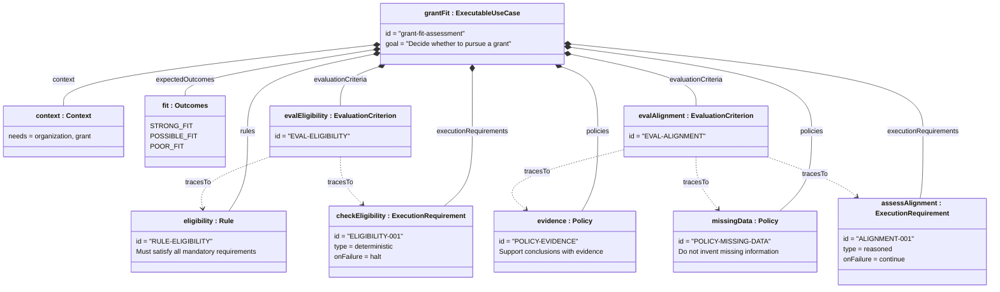
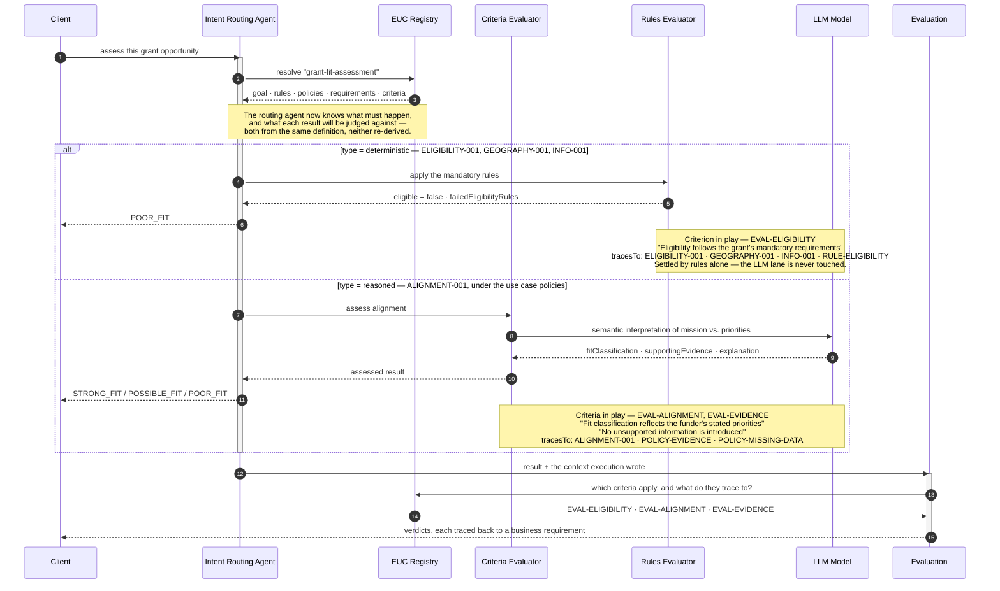
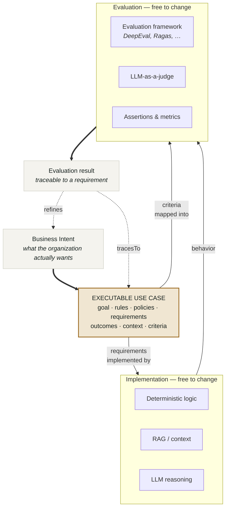
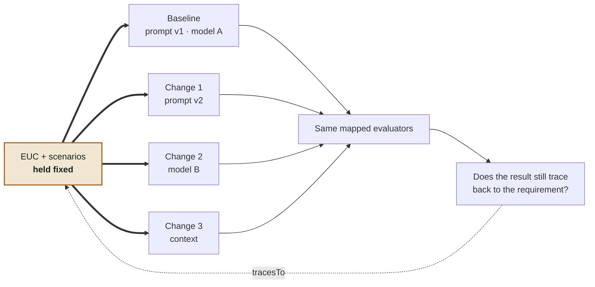

# Keeping AI Applications Aligned with Business Intent

*InfoQ AI Engineering Certification — System-Building Project*
*Participant: Basari (solo)*

| # | Section | The question it answers |
|---|---|---|
| 1 | [The question nobody can answer](#1-the-question-nobody-can-answer) | Why is this hard? |
| 2 | [From use case to executable use case](#2-from-use-case-to-executable-use-case) | What would a stable reference look like? |
| 3 | [What an EUC is made of](#3-what-an-euc-is-made-of) | What are its parts, and how do they relate? |
| 4 | [Trying it on a real decision](#4-trying-it-on-a-real-decision) | Does it survive contact with a real use case? |
| 5 | [Where the EUC sits](#5-where-the-euc-sits) | What does it *not* do? |
| 6 | [Testing whether the link holds](#6-testing-whether-the-link-holds) | How would we know if this is wrong? |
| 7 | [Why this matters in practice](#7-why-this-matters-in-practice) | What is it worth? |
| 8 | [Building only what we need](#8-building-only-what-we-need) | What gets built, and what counts as success? |
| 9 | [Where this stands](#9-where-this-stands) | What is actually done? |
| — | [Appendix A: Implementation notes](#appendix-a-implementation-notes) | |
| — | [Appendix B: Spec-driven development](#appendix-b-related-approach-spec-driven-development) | |
| — | [Appendix C: Future work](#appendix-c-future-work) | |
| — | [References](#references) | |

---

## 1. The question nobody can answer

Picture a team six months into an AI-native application. It works. It shipped.

Since launch, someone has tightened a prompt, someone else swapped in a newer model
because it was cheaper and faster, the retrieval layer was re-chunked, and a
downstream service started returning an extra field that quietly changed what the
model sees. Every one of those changes was reasonable. Every one was reviewed. The
test suite is green.

Then a stakeholder asks a question that should be easy:

> **Is the application still doing what the business intended?**

And the room goes quiet — not because the team is careless, but because no one can
point at the thing that would settle it. Business intent lives in a requirements doc
someone wrote in month one, in a prompt that has been edited forty times since, in
application code, in policy constraints, and in a set of evaluation cases written by
whoever was closest to the model that week.

Each of those artifacts holds a piece of the intent. None of them is the intent.

### Why a green test suite isn't the answer

In conventional software, a passing test suite is a decent proxy for correctness,
because the behavior it checks is deterministic: same input, same output, and any
divergence is a bug you can bisect.

An AI-native application breaks that proxy. Its behavior is partly deterministic
(code, rules) and partly probabilistic (model judgment), and the probabilistic half
can shift without a single line of code changing. Worse, when evaluation criteria
were derived from intent once, informally, and then maintained separately, a passing
evaluation only demonstrates that the evaluation still agrees with itself.

> **A passing evaluation shows internal consistency. It does not show that intent
> was preserved.**

This is not only a requirements problem. It becomes a production problem when the
misalignment surfaces late and the team has to reopen requirements, implementation,
and evaluation at the same time — usually under pressure, usually with the original
authors gone.

### The central question

That leads to the question this project exists to test:

> **Can an Executable Use Case provide a stable link between business intent, AI
> implementation, and evaluation as an AI-native application evolves?**

To answer it, we first have to decide what should stay still when everything around
it moves.

---

## 2. From use case to executable use case

The idea starts somewhere familiar.

Use cases have described software from the point of view of a user and a business
goal for over thirty years. Ivar Jacobson originated the approach at Ericsson in the
1980s and formalised it in *Object-Oriented Software Engineering* (1992) [1]; he
later co-authored *The Unified Software Development Process* [2] and was one of the
three principal contributors to UML, where the use case diagram is still standard
notation.

A traditional use case names an **actor**, a **goal**, a main flow of steps toward
that goal, alternate flows, and pre- and post-conditions. That makes it a natural
place to look for a stable expression of business intent: it is deliberately about
*what the business needs*, not *how the software achieves it*.

It has one disqualifying limitation here. It is prose. A person can read it,
discuss it, and implement it by hand — but no application can consult it at runtime,
and no evaluation harness can score against it. When the model underneath changes,
the use case has nothing to say, because nothing was ever wired to it.

### The proposed step

Make the use case machine-readable, and keep it strictly about business behavior.

An **Executable Use Case (EUC)** captures what must hold: the goal, the rules, the
policies, the required responsibilities, the acceptable outcomes, the context the
decision depends on, and the criteria by which it should be judged.

It deliberately says nothing about prompts, models, retrieval strategy, frameworks,
or code. Those remain entirely free to change — that is the point. "Executable" is
doing real work in the name: the artifact is meant to be consulted by software, not
just read by people.

> **Industry example — Forward Deployed Engineering**
>
> A Forward Deployed Engineer translates a client's intent into a working AI
> solution: code, prompts, context, tools, policies, and model reasoning. As the
> solution evolves over weeks, a practical question surfaces on both sides of the
> table: *how do the client and the engineering team know they still agree on what
> "done" means?*
>
> An EUC gives both sides one shared business reference. The domain stakeholder can
> review it in business terms they recognise. The engineer can trace implementation
> and evaluation artifacts back to the same requirements. Neither has to take the
> other's word for it.
>
> This does not replace the implementation or the evaluation framework. It keeps
> requirements → implementation → evaluation connected while the system changes
> underneath.

---

## 3. What an EUC is made of

### The parts

| Element | What it defines |
|---|---|
| **Goal** | The business objective |
| **Rules** | Deterministic business requirements |
| **Policies** | Behavioral constraints and guardrails that cut across the whole use case |
| **Execution requirements** | The business responsibilities the application must carry out |
| **Outcomes** | The acceptable business outcomes |
| **Evaluation criteria** | What must be checked, and which requirement each check stands for |
| **Context** | The business information the decision depends on |

### How the parts relate

The structure matters more than any single field, so it is worth seeing as objects
rather than as a schema listing. Below is one real EUC instance — the Grant Fit
Assessment used throughout this proposal — with its parts and the relationships
between them.

The relationship to notice is `tracesTo`. It is the only thing in the artifact that
makes traceability concrete rather than aspirational: every evaluation criterion
names the requirement, rule, or policy it exists to validate. Follow those arrows
backwards from any evaluation result and you arrive at a business requirement.



Two things are worth reading off that diagram.

**Policies are not owned by any one requirement.** "Do not invent missing
information" is not a property of the alignment step; it is a constraint every
reasoned step must respect. Jacobson made the same move in
*Aspect-Oriented Software Development with Use Cases* [3], for concerns that cut
across use cases rather than living inside one. A policy is structurally an aspect.

**Evaluation points at requirements, not at implementations.** `EVAL-ALIGNMENT`
does not name a prompt, a model, or a test file. It names `ALIGNMENT-001`,
`POLICY-EVIDENCE`, and `POLICY-MISSING-DATA`. That is what allows the implementation
underneath to be replaced without the evaluation losing its meaning.

### The same thing, as data

A machine-readable form of the instance above. JSON is one option; YAML would do
equally well. The idea matters more than the syntax.

```json
{
  "id": "grant-fit-assessment",
  "goal": "Determine whether the organization should pursue a grant",

  "rules": [
    { "id": "RULE-ELIGIBILITY",
      "description": "Must satisfy all mandatory eligibility requirements" }
  ],

  "policies": [
    { "id": "POLICY-EVIDENCE",
      "description": "Support conclusions with available evidence" },
    { "id": "POLICY-MISSING-DATA",
      "description": "Do not invent missing information" }
  ],

  "expectedOutcomes": ["STRONG_FIT", "POSSIBLE_FIT", "POOR_FIT"],

  "executionRequirements": [
    { "id": "ELIGIBILITY-001",
      "type": "deterministic",
      "responsibility": "Evaluate mandatory eligibility",
      "writes": ["eligible"],
      "onFailure": "halt" },

    { "id": "ALIGNMENT-001",
      "type": "reasoned",
      "responsibility": "Assess organization-to-grant alignment",
      "reads": ["eligible"],
      "writes": ["fitClassification", "supportingEvidence", "explanation"] }
  ],

  "evaluationCriteria": [
    { "id": "EVAL-ELIGIBILITY",
      "tracesTo": ["ELIGIBILITY-001", "RULE-ELIGIBILITY"],
      "criteria": ["Eligibility follows mandatory grant requirements"] },

    { "id": "EVAL-ALIGNMENT",
      "tracesTo": ["ALIGNMENT-001", "POLICY-EVIDENCE", "POLICY-MISSING-DATA"],
      "criteria": [
        "Fit classification is supported by evidence",
        "Explanation supports the classification",
        "No unsupported information is introduced"
      ] }
  ]
}
```

The important distinction is between **business requirements** and **implementation
details**. `executionRequirements` describe what the application must do.
`evaluationCriteria` describe what must be checked. `tracesTo` connects the two.
Nothing here says *how*.

> **This is what the prototype actually loads.** `EucLoader` parses exactly this
> shape, and `EucDefinition.validate()` rejects a `tracesTo` entry that names
> something the EUC does not declare — so a broken link between an evaluation
> and the requirement it claims to validate fails at load time rather than
> surfacing later as a result nobody can account for. A single mistyped id
> fails the build.

---

## 4. Trying it on a real decision

A schema is easy to admire in the abstract. The question is whether the separation
survives a real decision, so the prototype uses one.

A **Grant Fit Assessment** helps a nonprofit decide whether a grant opportunity is
worth pursuing. Applying costs real staff time, so knowing in advance matters. The
assessment compares an organization's profile and programs against a grant's
requirements and funding priorities, and answers two questions:

1. **Is the organization eligible?**
2. **How well does the grant align with the organization's mission and programs?**

Those two questions behave completely differently.

| Deterministic | LLM-reasoned |
|---|---|
| Organization eligibility | Mission alignment |
| Geographic requirements | Program alignment |
| Mandatory constraints | Evidence interpretation |
| Required information present | Explanation |

Eligibility is governed by explicit rules — it passes or fails, and changing a rule
is a deliberate act. Alignment is interpretive: it needs a model to weigh evidence
and explain a judgment.

Yet they are halves of one business decision, and the relationship between them is
asymmetric in a way the business cares about: **strong alignment cannot rescue
failed eligibility.** That asymmetry is exactly the kind of thing that lives in a
requirements doc, gets implemented once, and is never checked again.

That makes this a useful test. The business intent stays unified while the
implementation and evaluation techniques differ on either side of it.

### One request, end to end

The interaction below shows a single assessment crossing the boundaries a real
deployment would draw. The routing agent reads the use case once, then routes each
requirement by its declared `type` — and the two branches behave completely
differently.

On the **deterministic path**, a failed mandatory rule short-circuits to `POOR_FIT`
without ever invoking the model: no tokens spent, and no chance for a persuasive
explanation to paper over a hard failure. On the **reasoned path**, the question goes
to semantic interpretation under the use case's policies, because no rule can settle
whether a mission genuinely aligns with a funder's priorities.

The notes on each branch name the criterion in play and what it traces back to. That
is the property worth watching: whichever path a request takes, the verdict at the
end resolves to a business requirement.

Note the last steps. Evaluation asks the *same* registry the routing agent read from
which criteria apply, and scores the context execution actually produced — not a
separately maintained copy of what someone believed the intent to be.



---

## 5. Where the EUC sits

The prototype uses ordinary AI-native components. None of them is being reinvented;
they are the environment in which the EUC idea can be tested.

| Component | Role in the prototype |
|---|---|
| Deterministic logic | Implements explicit business rules |
| RAG / context | Supplies information the use case requires |
| LLM reasoning | Handles qualitative assessment |
| Evaluation framework | Runs test cases, metrics, assertions, model-based evaluators |
| LLM-as-a-judge | Evaluates criteria that need semantic judgment |

### What the EUC does not do

**The EUC does not perform retrieval, does not control model reasoning, and does not
run evaluations.** It is not a framework and not a runtime. This is the most commonly
misread part of the idea, and the boundary is deliberate: an artifact that did any of
those things would have to change when they changed, which is exactly what it exists
not to do.

Existing tools — DeepEval, Ragas, or whatever a team already uses — provide the
evaluation machinery. An EUC criterion is *mapped into* that machinery: to a
deterministic assertion, to a standard metric, or to an LLM-as-a-judge rubric.



The one sentence that captures the whole boundary:

> **The evaluation framework measures behavior. The EUC keeps that measurement
> connected to the business requirement it is meant to validate.**

Which gives us something concrete to test. If the prompt, the model, or the context
changes, can the same business reference still connect implementation to evaluation?

---

## 6. Testing whether the link holds

The validation follows directly from that question. Hold the EUC and the business
scenarios fixed, change selected parts of the AI application, re-run the
evaluations, and observe whether the results still trace back to the original
requirements.

### 6.1 Establish a stable reference

One Grant Fit use case, roughly 10–15 controlled scenarios. The goal is
deliberately narrow: test whether business requirements remain traceable to
evaluation as the application changes.

The EUC and the scenarios stay fixed for the whole experiment. Each EUC evaluation
criterion is mapped once to an evaluator in the chosen framework.

| Scenario | Business expectation |
|---|---|
| Eligible + strong alignment | `STRONG_FIT` |
| Eligible + weak alignment | Outcome stays within acceptable fit criteria |
| Failed eligibility | Must not produce a pursue recommendation |
| Missing evidence | Surface uncertainty |
| Unsupported claim | Do not invent information |
| Conflicting evidence | Identify the conflict |

The last three are the ones that matter most. They are where a changed model is
most likely to produce a *plausible* answer for the wrong reason — the failure that
a shallow evaluation waves through.

### 6.2 Change the application, not the business intent

Run a baseline. Then change one implementation or context variable at a time, while
the EUC, the scenarios, and the business criteria stay untouched:

- the prompt or instructions;
- the model;
- the retrieved or supplied context;
- how evidence is presented.

Deterministic requirements are checked with assertions where possible. Semantic
requirements use standard metrics or an LLM-as-a-judge.



### 6.3 Follow the result back to the requirement

For each controlled change, three questions:

1. Did runtime behavior violate an EUC business criterion?
2. Did the mapped evaluator identify the violation?
3. Can the result be traced back to the originating EUC requirement?

| Behavior | Evaluation | Interpretation |
|---|---|---|
| Violates criterion | Flagged | Correct detection |
| Violates criterion | Passed | **False negative** — the risk that matters most |
| Satisfies criterion | Flagged | False positive |
| Satisfies criterion | Passed | Correct pass |

A **false negative** is the outcome that would falsify the idea: behavior drifted, and
evaluation waved it through. That would mean EUC-anchored evaluation offers no real
advantage over the status quo it is meant to improve on. A **false positive** rate
that is too high means the criteria are brittle, or coupled too tightly to one
implementation to serve as a stable reference.

Both failure modes are deliberately observable. **A negative result is a legitimate
finding, not a failed project** — the experiment is designed so that "this does not
work, and here is precisely where it breaks" is a publishable outcome.

Results focus on traceability coverage, violation detection, and false flags. The
experiment also records cases where a business criterion turns out to be *hard to
translate into a reliable evaluator* — a gap worth documenting either way.

### 6.4 Record what the change cost

Because traceability should also affect the cost of change, each controlled change
records a small set of effort indicators:

| Effort indicator | What is recorded |
|---|---|
| EUC changes | Whether the business reference had to change at all |
| Implementation changes | Prompt, code, RAG, model, or context changes |
| Evaluator changes | Tests, metrics, assertions, or rubrics that had to change |
| Traceability breaks | Requirements that lost or needed a new mapping |
| Rework | Additional changes required after an evaluation failure |

These do not attempt to prove an enterprise-wide ROI. They test a smaller and more
defensible question:

> **When business intent has not changed, can the application be changed and
> re-evaluated without redefining the requirement or rebuilding its
> business-specific evaluation criteria?**

If evaluation stays connected to the same business requirements while the
implementation changes — with limited requirement and evaluator rework — that is
evidence for both the traceability argument and a potential cost-of-change benefit.

---

## 7. Why this matters in practice

The immediate question is whether an EUC can preserve a traceable link between
intent, implementation, and evaluation as an AI application changes.

If that link holds, a second and more practical benefit follows: **reducing the cost
of change.**

Production AI costs extend well beyond model inference. Teams spend their time
integrating systems, refining prompts and context, defining evaluations, satisfying
governance requirements, investigating failures, and reworking solutions when
behavior does not match business expectations.

The industry numbers are specific:

- McKinsey reports that **models may account for only about 15%** of a typical GenAI
  project's effort, and estimates roughly **$3 of change-management spend for every
  $1 of model development** [4].
- Gartner reported in 2026 that **at least 50% of GenAI projects had been abandoned
  after proof of concept**, citing escalating costs among the reasons [5].
- McKinsey also finds that **reusable code is associated with 30–50% faster**
  GenAI use-case development, and that standardised, reusable platform components
  eliminate substantial nonessential work [4]; separately, that **30–50% of a team's
  GenAI innovation time** may go into making solutions compliant or waiting for
  requirements to become practical [6].

So the proposed benefit is not cheaper tokens or a cheaper model. It is reducing the
work that has to be repeated every time the implementation changes.

If business intent has not changed, the team should not have to rediscover what the
application is supposed to do, or redefine what acceptable behavior means. The same
EUC stays the reference while the implementation evolves and the mapped evaluations
are re-run.

> **Cost hypothesis.** By preserving business intent across implementation and
> evaluation, an EUC may reduce requirements clarification, evaluator redesign, and
> late-stage rework as AI applications evolve.

This capstone does not attempt an enterprise-wide ROI or a claimed percentage
saving. It tests the smaller question: can preserving business intent as a reusable,
machine-readable reference reduce the work required to safely change and re-evaluate
an AI application?

---

## 8. Building only what we need

The prototype is intentionally small. It defines one Grant Fit EUC, implements
deterministic eligibility and LLM-based alignment, adds RAG/context, and integrates
one evaluation framework. EUC criteria are mapped to whichever evaluation mechanism
fits — deterministic assertion, standard metric, or LLM-as-a-judge — across roughly
10–15 scenarios for the baseline and controlled-change runs.

### What would count as success

| Criterion | Evidence |
|---|---|
| Machine-readable business reference | A working EUC definition |
| Implementation traceability | Implementation artifacts identify the EUC requirements they satisfy |
| Evaluation traceability | Evaluators identify the EUC criteria they measure |
| Result traceability | Evaluation results can be traced back to originating criteria |
| Stable reference under change | Baseline and changed implementations use the same EUC |
| Visible mapping gaps | Requirements that cannot be mapped reliably are documented |
| Change effort is observable | Requirement, implementation, evaluator and rework changes are recorded |

If the prototype demonstrates these properties, the project delivers:

- a working EUC schema centred on business intent and traceability;
- a prototype showing how EUC requirements map to familiar AI-native components;
- a mapping from EUC evaluation criteria into an existing evaluation framework;
- measured results from controlled implementation and context changes;
- lightweight evidence about requirement/evaluator rework and cost of change; and
- documented traceability gaps, failure modes, and limitations.

Even a mixed result is useful. If some requirements stay reusable and traceable
while others need substantial reinterpretation, the experiment shows *where* EUCs
help and where additional mechanisms are needed.

AI implementations will keep changing. Models will improve, prompts will evolve,
retrieval strategies will be replaced, evaluation techniques will mature.

> **The business intent should not have to be rediscovered every time they do.**

This project investigates whether the use case itself can become the stable,
machine-readable link that keeps those changes aligned.

---

## 9. Where this stands

An honest account of the prototype as of this revision.

| Status | Item |
|---|---|
| ✅ Built | EUC schema defined and JSON authored; model and loader in Java, with `validate()` enforcing the contract at load time |
| ✅ Built | Deterministic eligibility rule engine, unit tested |
| ✅ Built | LLM-reasoned alignment assessment calling the Anthropic Messages API |
| ✅ Built | Evaluator bound to the EUC's evaluation criteria, unit tested |
| ✅ Built | Eval dataset with independently-established ground truth, including both edge cases (eligible-but-misaligned, ineligible-but-aligned) |
| ✅ Built | The `onFailure: halt` contract, verified offline with a reasoner that fails the test if it is ever invoked after a halt |
| ✅ Built | Controlled-change harness: baseline plus prompt and model variants, computing the result metrics — verified against known inputs with fake reasoners |
| ✅ Built | 34 tests passing offline, covering the deterministic layer, the halt contract, the evaluators, the controlled-change metrics, and the traceability contract above |
| ✅ Built | **The EUC now carries traceability, not an implementation choice.** Migrated to `rules` / `policies` / `executionRequirements` / `evaluationCriteria` with `tracesTo`; the `filter` and `group` keys are gone from the artifact, and implementations bind to requirement ids instead ([Section 3](#3-what-an-euc-is-made-of)) |
| ✅ Built | **`tracesTo` is enforced at load time.** A criterion tracing to an undeclared id fails validation with a message naming the broken link; `untracedIds()` reports anything no criterion checks, so mapping gaps are visible rather than silent |
| ⏳ Next | **Map criteria into an existing evaluation framework** (DeepEval or Ragas) rather than the current bespoke evaluator ([Section 5](#5-where-the-euc-sits)) |
| ⏳ Next | **Expand the dataset** from 6 to 10–15 scenarios, covering all six business expectations in [Section 6.1](#61-establish-a-stable-reference) |
| ⏳ Next | **Record the effort indicators** in [Section 6.4](#64-record-what-the-change-cost) during controlled-change runs |
| ⏳ Pending | First live evaluation pass and controlled-change run against a real model — all wiring is verified offline; only the network call itself remains unexercised in the current environment |

**Not yet done, by design:** the reasoning layer has not been run against a live
model in this environment, because no API key is configured here. Running it is the
natural next step with the repository checked out locally.

---

## Appendix A. Implementation notes

The proposal focuses on the idea and the experiment. The choices below support that
experiment but are not themselves the research contribution.

### Evaluation framework

An existing framework such as DeepEval or Ragas provides test cases, metrics,
assertions, and LLM-based evaluators. EUC criteria are mapped into the inputs that
framework requires.

> The EUC says *what the business needs validated*; the evaluation framework
> provides the tools to measure it.

Choosing the best evaluation framework is outside the scope of this capstone.

### Pipe-and-filter mapping

The prototype may use a pipe-and-filter arrangement, because it maps cleanly onto
the EUC's execution responsibilities:

| EUC | Prototype |
|---|---|
| Execution requirements | Filter responsibilities |
| `reads` / `writes` | Shared context |
| `onFailure` | Pipeline control |
| Evaluation criteria | Evaluator mappings |

**This is an implementation choice, not a requirement of the EUC concept.** An EUC
describes business responsibilities; how they are orchestrated is up to the
implementation.

The prototype keeps that boundary in one specific way worth naming: implementations
register against the *id of the requirement they satisfy*
(`registry.register("ELIGIBILITY-001", new EligibilityRuleFilter())`). The direction
matters. Code names the business requirement it implements, so the EUC never has to
name a class, and swapping the implementation cannot disturb the statement of
intent.

---

## Appendix B. Related approach: Spec-Driven Development

EUCs and Spec-Driven Development (SDD) both use machine-readable specifications, but
they aim at different problems.

| | Spec-Driven Development | Executable Use Cases |
|---|---|---|
| Primary focus | Guide or generate implementation from a specification | Keep business intent connected across implementation and evaluation |
| Primary traceability | Specification ↔ implementation | Business intent ↔ implementation ↔ evaluation |
| Evaluation | Tests may be generated from the specification | Business-specific evaluation criteria stay traceable to EUC requirements |

The sharpest distinction: SDD is about **generation** — spec in, code out, largely a
build-time translation. EUCs are about **traceability under change** — the reference
does not change; the thing running underneath it does; the question is whether the
same reference still connects behavior to intent.

The field's own maturity taxonomy — spec-first, spec-anchored, spec-as-source [7] —
has a middle tier, *spec-anchored*, where the specification evolves alongside the
software rather than being discarded after generation. That is closer to what an EUC
does than either endpoint. The two approaches complement each other; generating code
or evaluators directly from an EUC is plausible future work, not part of this
experiment.

---

## Appendix C. Future work

If the initial experiment is promising:

- agentic and self-correcting workflows that trace decisions and evaluations back to
  stable EUC requirements;
- automatic generation of implementation or evaluation artifacts from EUC
  requirements;
- richer context-dependency mappings for RAG and GraphRAG;
- CI/CD evaluation gates and operational monitoring linked to EUC criteria; and
- EUC libraries for sharing business intent across teams and systems.

---

## References

**Use-case lineage**

1. Jacobson, I. *Object-Oriented Software Engineering: A Use Case Driven Approach.*
   Addison-Wesley, 1992.
2. Jacobson, I., Booch, G., Rumbaugh, J. *The Unified Software Development Process.*
   Addison-Wesley, 1999.
3. Jacobson, I., Ng, P-W. *Aspect-Oriented Software Development with Use Cases.*
   Addison-Wesley, 2004.

**Industry cost and production context**

4. McKinsey & Company, "Moving past gen AI's honeymoon phase: Seven hard truths for
   CIOs to get from pilot to scale." Reports that models may account for only about
   15% of a typical GenAI project's effort, estimates roughly $3 of
   change-management spend for each $1 of model development, and notes that reusable
   code can increase GenAI use-case development speed by 30–50%.
5. Gartner, "Why 50% of GenAI Projects Fail — And How to Beat the Odds,"
   January 26, 2026. Reports that at least 50% of GenAI projects had been abandoned
   after proof of concept by the end of 2025, citing poor data quality, inadequate
   risk controls, escalating costs, or unclear business value.
6. McKinsey & Company, "Overcoming two issues that are sinking gen AI programs."
   Reports that roughly 30–50% of a team's GenAI innovation time may be spent making
   solutions compliant or waiting for requirements to become practical, and
   describes duplicated and one-off work as barriers to scale.

**Related work**

7. Spec-driven development maturity taxonomy — spec-first, spec-anchored,
   spec-as-source.
