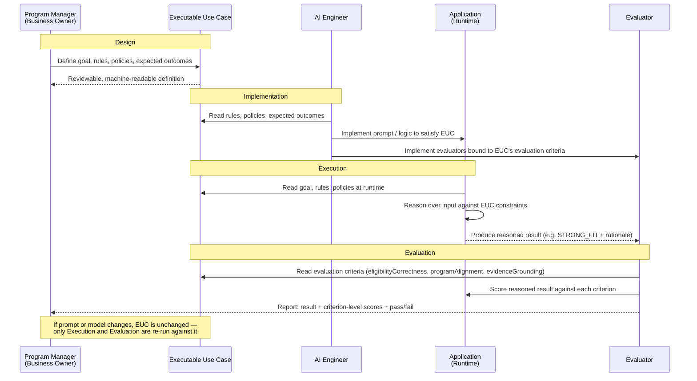

# Executable Use Cases: Preserving Business Intent Across the AI Application Lifecycle

*InfoQ AI Engineering Certification — Capstone Project Proposal*

---

## 1. Problem Statement

As organizations move AI-native applications from prototype to production, they're running into a problem traditional software evaluation wasn't built for: the criteria for "correct" behavior are inherently fuzzier, and they drift. A prompt tweak, a model upgrade, or a context-window change can silently shift what an application actually does — while the tests, dashboards, and stakeholders still assume the original intent holds. Unlike deterministic systems, where a passing test suite is a reliable proxy for correctness, LLM-based applications can degrade or drift in ways that pass superficial checks while failing the underlying business goal.

This is compounded by a second, quieter problem: business intent itself becomes fragmented. It lives partly in a requirements doc, partly in a prompt, partly in application logic, partly in ad hoc eval scripts written after the fact — with no single artifact anyone can point to as the source of truth. When a model changes, teams often can't say with confidence whether they're still building the same thing they set out to build, because "the thing" was never captured in one traceable place.

This project proposes Executable Use Cases (EUCs): first-class, machine-readable SDLC artifacts that encode a use case's goals, rules, constraints, expected outcomes, and evaluation criteria in a single definition — one that drives both runtime execution and evaluation, rather than treating them as separately maintained concerns.

**Business Intent → EUC → Execution + Evaluation**

The goal is to make business intent a durable, versioned artifact that survives the churn of prompt iteration and model upgrades — so that "did we break this?" has a concrete, testable answer instead of a subjective one.

The approach will be validated through a [Grant Fit Assessment](#5-case-study-grant-fit-assessment) case study: an AI-native application where the same EUC governs both runtime behavior and evaluation. As the underlying prompt or model is changed, the case study will test whether the application can still be evaluated against a stable, unchanged definition of business intent — the central claim EUCs are meant to support.

---

## 2. Gap in Current Practice

AI-native applications introduce implementation layers that traditional software didn't have to reconcile against business requirements. A conventional application encodes its logic once, in code that can be inspected and diffed. An AI-native application spreads that same logic across prompts, retrieved context, model behavior, application code, and policy constraints — each of which can change independently, and each of which only partially reflects the original business intent.

```
                 Business Intent
                       |
        +--------------+--------------+
        |              |              |
        v              v              v
   Application       Prompt /       Evaluation
      Logic           Context        Criteria
```

This creates a concrete failure mode: a team updates a prompt to fix one behavior, or swaps in a new model version, and the application's evaluation suite still passes — not because business intent was preserved, but because the evaluation criteria were never actually anchored to that intent in the first place. They were derived from it once, informally, then maintained separately. The eval and the application drift apart silently, and nothing in the system surfaces that divergence until a stakeholder notices the output is wrong.

Existing practice treats this as a documentation and process problem — requirements docs, prompt changelogs, eval test cases maintained by hand. But each of these artifacts is optimized for a different audience and updated on a different cadence, so keeping them mutually consistent depends on discipline rather than structure. None of them function as a single, machine-readable definition that both the running application and its evaluation can be checked against.

This gap matters most for evaluation specifically: an evaluation can faithfully measure what a system does, but that measurement is only meaningful if its criteria remain grounded in the business behavior the application is meant to deliver. If the criteria and the application intent have already diverged, a passing eval demonstrates internal consistency, not correctness.

This project explores whether business intent can instead be persisted as a single machine-readable artifact — shared by execution and evaluation — so that drift between them becomes detectable rather than assumed away.

---

## 3. Proposed Approach: Executable Use Cases

An Executable Use Case (EUC) represents the business intent and expected behavior of a use case in a form consumable by both people and software — a single definition that an application can be built against and evaluated against, rather than two definitions maintained in parallel.

```json
{
  "id": "grant-fit-assessment",
  "actor": "Nonprofit Program Manager",
  "goal": "Determine whether the organization should pursue a grant",
  "rules": [
    {
      "id": "ELIGIBILITY-001",
      "type": "deterministic",
      "description": "Applicant must satisfy mandatory eligibility requirements"
    }
  ],
  "policies": [
    "Do not invent missing information",
    "Support conclusions with evidence"
  ],
  "expectedOutcomes": [
    "STRONG_FIT",
    "POSSIBLE_FIT",
    "POOR_FIT"
  ],
  "evaluation": [
    "eligibilityCorrectness",
    "programAlignment",
    "evidenceGrounding"
  ]
}
```

A few things are worth noting in this structure. Rules are typed (`deterministic` here) because not every constraint in an AI-native application behaves the same way — some are hard checks that either pass or fail, others are judgment calls that require a model to weigh evidence. Policies capture behavioral constraints that don't map cleanly to a single rule (e.g., "do not invent missing information") but still need to be both enforced at runtime and checked during evaluation. And the evaluation criteria reference the same goal and outcomes the execution path uses — they aren't a separately authored test suite that happens to cover similar ground.

The contribution is not the JSON format itself; a schema is an implementation detail and could reasonably take other forms. The contribution is the architectural decision it encodes: the use case exists once, as a first-class SDLC artifact, rather than being translated separately into application logic on one side and evaluation criteria on the other. In current practice, those two translations happen independently, at different times, by different people or processes — which is exactly the divergence described in Section 2. An EUC removes the translation step by making the definition itself the thing both execution and evaluation consume.

```
                 Business Intent
                       |
                       v
              Executable Use Case
                 /           \
                v             v
           Execution      Evaluation
```

This creates a shared contract between what the application is expected to do and how its behavior is measured — not a documentation artifact that execution and evaluation each separately reference, but the actual source both are derived from. When the underlying model or prompt changes, the EUC doesn't change with it; that stability is what Section 4's falsifiable claims will test.

### EUC Across the Lifecycle

The sequence diagram below traces the EUC through a single lifecycle, from authoring to reasoned result.



During design, the business owner authors the EUC directly — goal, rules, policies, and expected outcomes are expressed at the level a non-engineer can review, not buried in a prompt. During implementation, the AI engineer treats the EUC as the specification: both the application logic and the evaluators are built by reading the same artifact, rather than the evaluator being derived secondhand from the application's behavior. During execution, the application consults the EUC's rules and policies at runtime and produces a reasoned result — in the Grant Fit case, an outcome (`STRONG_FIT`, `POSSIBLE_FIT`, `POOR_FIT`) along with the reasoning behind it. During evaluation, that reasoned result is scored against the EUC's evaluation criteria — the same criteria the engineer implemented against, not a parallel test suite written independently.

The point highlighted at the bottom of the diagram is the one the case study is designed to test: when a prompt or model changes, only the Execution and Evaluation steps re-run — the EUC itself, and therefore the definition of correctness, stays fixed. If that holds, the evaluator's output remains a meaningful signal of drift from business intent, rather than a moving target that changes definition alongside the thing it's measuring.

---

## 4. Falsifiable Claims

The central claim of this project is narrow and testable: **when the underlying prompt or model changes, evaluation against a fixed EUC will detect meaningful drift from business intent, without the EUC itself needing to change.** This claim can fail in either direction, and both failure modes matter:

- **False negative (the risk that matters most):** a prompt or model change alters the application's actual behavior — e.g., the reasoning shifts from evidence-grounded to speculative, or mission-alignment judgments become inconsistent — but evaluation against the EUC still reports a pass. This would mean EUC-driven evaluation offers no real advantage over the status quo it's meant to replace.
- **False positive:** evaluation reports a failure or drift when the application's behavior has not, in fact, diverged from business intent. This would mean the EUC's evaluation criteria are too brittle or too tightly coupled to a specific prompt/model implementation to serve as a stable definition of correctness — undermining the claim that the EUC is implementation-independent.

A secondary, supporting claim: **the deterministic and LLM-reasoned portions of the EUC will behave differently under these changes**, since Section 5 establishes that only the LLM-reasoning layer (mission/program alignment, evidence interpretation, explanation) is exposed to prompt or model drift, while deterministic rules (eligibility, geographic requirements) should remain stable regardless of model changes. If deterministic-rule evaluation results also shift when only the model changes, that would indicate a flaw in the EUC's separation of concerns rather than a success of the approach.

These claims are deliberately falsifiable: the case study is designed so that a negative result — EUC-driven evaluation failing to catch a known, deliberately introduced drift — is a legitimate and informative outcome, not just a validation exercise.

---

## 5. Case Study: Grant Fit Assessment

Nonprofits fund their programs in part by applying for grants from foundations, government agencies, and other funders. Each grant carries its own eligibility requirements, funding priorities, target populations, geographic restrictions, and program objectives — and applying takes real staff time, so nonprofits need to know in advance whether a given opportunity is worth pursuing.

A Grant Fit Assessment answers that question. It compares an organization's profile and programs against a grant's requirements and priorities to determine both eligibility and alignment. The two are distinct and neither substitutes for the other: an organization can be legally eligible for a grant and still be a poor fit if its programs don't align with the funder's priorities, and strong alignment cannot overcome a mandatory eligibility requirement the organization fails to meet.

This makes Grant Fit Assessment a useful testbed for EUCs specifically, because it combines two kinds of logic that behave differently under evaluation:

| Deterministic Logic | LLM Reasoning |
|---|---|
| Organization eligibility | Mission alignment |
| Geographic requirements | Program alignment |
| Required information present | Evidence interpretation |
| Mandatory constraints | Explanation generation |

Hard eligibility requirements are deterministic — they either pass or fail, and a rule change is a code change. Fit assessment is not — it requires the LLM to weigh how closely an organization's mission and programs align with a funder's stated priorities, using the applicant's supporting information as evidence. This split means the case study can isolate where EUC-driven evaluation actually earns its value: deterministic rules can be checked by conventional means, but LLM reasoning is exactly the layer where prompt or model changes are most likely to silently drift from business intent — which is the failure mode Section 2 identifies and the one this project is testing whether EUCs can detect.

**Inputs:** organization profile and programs, grant opportunity and funding priorities, eligibility requirements, and relevant supporting information.

**Outputs:** eligibility status, a `STRONG_FIT` / `POSSIBLE_FIT` / `POOR_FIT` classification, supporting evidence, explanation, and identified uncertainty.

---

## 6. Evaluation Methodology

To test the claims in Section 4, the case study will hold the EUC fixed and introduce controlled changes to the execution layer, then measure whether evaluation against the unchanged EUC correctly tracks the resulting behavior.

**Experimental design:**

1. **Baseline.** Implement the Grant Fit Assessment application against a single EUC (Section 3), with a fixed prompt and model. Run the application against a curated set of test cases spanning known outcomes — organizations expected to be `STRONG_FIT`, `POSSIBLE_FIT`, and `POOR_FIT`, including edge cases (eligible but poorly aligned; ineligible but well-aligned).
2. **Establish ground truth.** For each test case, establish an expected outcome and rationale independently of the application — reviewed against the EUC's rules and policies — so that evaluation results can be checked against something other than the application's own output.
3. **Introduce controlled changes.** Apply a series of isolated changes to the execution layer only — e.g., swap the underlying model, edit the prompt's phrasing of the alignment instructions, or alter how supporting evidence is presented to the model — without modifying the EUC.
4. **Re-run evaluation without re-authoring it.** For each change, run the same evaluators (bound to the EUC's `evaluation` criteria: `eligibilityCorrectness`, `programAlignment`, `evidenceGrounding`) against the new outputs, using the same ground truth.
5. **Classify each change as detected or undetected drift**, and compare against whether the change was known (by construction) to alter behavior meaningfully.

**Metrics:**

| Metric | What it measures |
|---|---|
| Drift detection rate | % of deliberately behavior-altering changes correctly flagged by evaluation |
| False-flag rate | % of behavior-neutral changes incorrectly flagged as drift |
| Deterministic-rule stability | Whether `eligibilityCorrectness` results remain unchanged across all execution-layer changes (Section 4's secondary claim) |
| Evidence-grounding consistency | Whether `evidenceGrounding` scores correlate with independently-reviewed presence/absence of supporting evidence in the reasoning output |

**Pass/fail criteria:** the approach is considered supported if the drift detection rate is high and the false-flag rate is low across the introduced changes, and if deterministic-rule evaluation results remain stable while only the LLM-reasoning layer changes. A high false-flag rate or a failure to detect known drift would falsify the central claim, per Section 4.

---

## 7. Expected Outcomes / Contribution

If the case study supports the claims in Section 4, the primary contribution is not the Grant Fit Assessment application itself but a validated pattern: that business intent can be persisted as a single machine-readable artifact that drives both execution and evaluation, and that doing so makes drift detectable rather than assumed away. That pattern is domain-independent — the EUC schema (goal, typed rules, policies, expected outcomes, evaluation criteria) doesn't depend on anything specific to grant assessment, and the deterministic/LLM-reasoning split observed here is likely to recur in other AI-native applications that mix hard business rules with judgment-based reasoning.

Concretely, this project should produce:

- A working EUC schema and worked example (Section 3), reusable as a starting template for other use cases.
- Empirical results (Section 6) on whether EUC-anchored evaluation actually catches drift introduced by prompt and model changes — the question most teams currently answer by intuition rather than measurement.
- A documented failure-mode analysis: if certain kinds of drift go undetected, or the deterministic/LLM separation breaks down under some changes, that's a concrete finding about where the approach's boundaries are, not just a negative result.

The broader case being made to the field is that evaluation infrastructure for AI-native applications needs a stable reference point that survives prompt and model iteration — and that this reference point should be authored once, by the people who own the business intent, rather than reconstructed independently by whoever happens to be implementing the eval suite at the time.

---

## 8. Limitations & Future Work

This project is a single case study on a single application domain, and its results should be read with that scope in mind.

- **Domain scope.** Grant Fit Assessment was chosen because it cleanly separates deterministic and LLM-reasoned logic (Section 5), but that separation may be harder to draw in domains with more interdependent rules, or where "correctness" is more subjective than fit classification. Whether EUCs hold up in those cases is untested here.
- **Single application, single team.** The EUC schema and the application are both authored by the same project, which limits what can be said about how well an EUC written by a business owner actually holds up when implemented by a separate engineering team — a gap that matters if EUCs are meant to function as a genuine handoff artifact rather than internal documentation.
- **Scale of drift tested.** The controlled changes in Section 6 are deliberately introduced and individually isolated. Real-world drift is often incremental, compounding, or introduced through many small changes over time (prompt tweaks accumulating across sprints, gradual model deprecation). Whether EUC-driven evaluation catches slow, compounding drift as reliably as it catches a single deliberate change is an open question.
- **Evaluation criteria authorship.** The evaluators bound to the EUC's evaluation criteria (`eligibilityCorrectness`, `programAlignment`, `evidenceGrounding`) still require someone to translate those criteria into implemented checks. This project doesn't test whether that translation step is itself a source of drift — i.e., whether two engineers implementing evaluators against the same EUC would produce equivalent evaluators.

Future work could extend this in a few directions: applying EUCs across multiple domains to test schema generality, involving a separate implementation team to test EUCs as a handoff artifact, and studying gradual/compounding drift rather than only discrete, deliberate changes.
